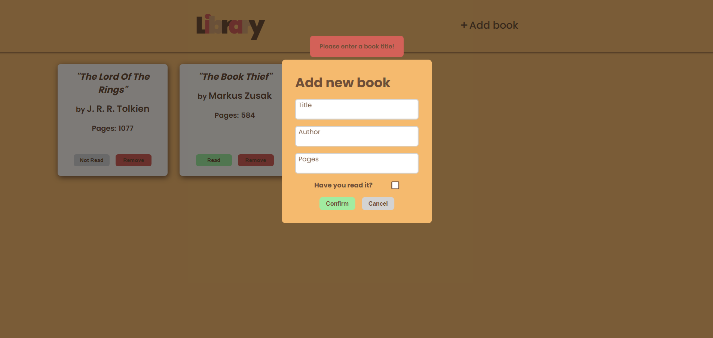

# Project: Library

## Overview

This project creates a simple library management system using JavaScript, HTML, and CSS. Users can add books by filling out a form, mark them as read or not read with a checkbox, and remove books from the library. The interface provides basic styling and functionality, suitable for expanding with additional features in the future.

Keep it to your [shelf](https://krig6.github.io/odin-library/)!

## Sample

## Technologies Used

- HTML: Structure and layout of the library.
- CSS: Styles the interface components, including layout, colors, typography, buttons, forms, and animations.
- JavaScript: Implements functionality using JavaScript classes.

## Features

- Add Book: Enables users to add new books to the library.
- Remove Book: Allows users to delete books from the library.
- Library Icon: Clickable icon that directly links to the project repository.
- Read Status: Books can be marked with color indicators to signify whether they have been read or not.
- Modal Form: Modal interface for seamless book addition.
- Modal Overlay: Overlay effect enhances focus when the modal is active.
- Local Storage Integration: Books are saved locally for persistent storage.
- Animated Error Messages: Displays error messages with animated effects.
- Custom Checkbox: Checkbox with animated visuals indicating status.

## Learning Path

This project is a big step forward in my journey through The Odin Project. It focuses on using JavaScript classes, which were both challenging and rewarding. As I worked with this project, I found new ways to solve problems and had moments where everything clicked—like when I figured out what was causing an issue or had ideas for improving the project. It's exciting to know there's always more to learn and explore in this journey.

## Future Enhancements

- Storing books in the cloud
- Organizing books by sorting
- Deleting multiple books at once
- Editing book details
- Animated interactions for a more engaging user experience
- Enhancing design responsiveness across all devices

## Acknowledgments

- [Google Fonts](https://fonts.google.com/) 
- [Boxicons](https://boxicons.com/)
